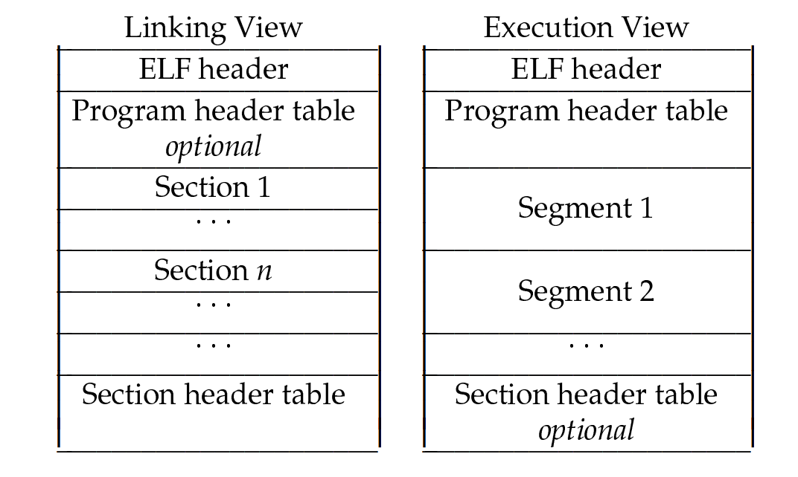
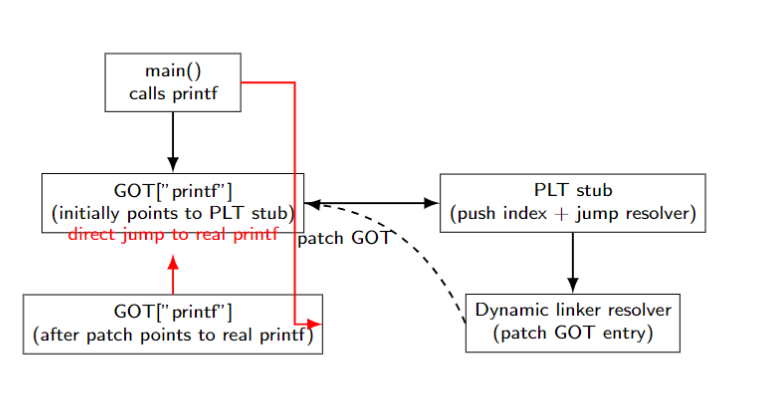

- [Understand Linker and ELF](#understand-linker-and-elf)
  - [Definition and Reference](#definition-and-reference)
  - [ELF File Format](#elf-file-format)
    - [ELF File Format](#elf-file-format-1)
    - [ELF File Types](#elf-file-types)
    - [Key ELF Structural Components](#key-elf-structural-components)
    - [Multiple Perspectives on ELF](#multiple-perspectives-on-elf)
  - [Static Linking](#static-linking)
    - [What linking process need?](#what-linking-process-need)
    - [Symbol Resolution](#symbol-resolution)
    - [Section Layout and Merging](#section-layout-and-merging)
    - [Relocation Processing](#relocation-processing)
    - [Static Linking Summary](#static-linking-summary)
  - [Dynamic Linking: PLT and GOT](#dynamic-linking-plt-and-got)
    - [Dynamic Linking vs Static Linking](#dynamic-linking-vs-static-linking)
    - [Global Offset Table (GOT)](#global-offset-table-got)
    - [Procedure Linkage Table (PLT)](#procedure-linkage-table-plt)
    - [Dynamic Linking Summary](#dynamic-linking-summary)
    - [GOT / PLT Lazy Binding: Pseudocode Flow](#got--plt-lazy-binding-pseudocode-flow)
    - [GOT / PLT Lazy Binding: Flow Diagram](#got--plt-lazy-binding-flow-diagram)
    - [Dynamic Linker Search Order for Shared Libraries](#dynamic-linker-search-order-for-shared-libraries)
  - [PIC and PIE](#pic-and-pie)
    - [PIC and PIE: Concepts and Differences](#pic-and-pie-concepts-and-differences)
    - [Position-Independent Code (PIC)](#position-independent-code-pic)
    - [Position-Independent Executable (PIE)](#position-independent-executable-pie)
    - [PIC vs PIE: Key Differences](#pic-vs-pie-key-differences)
  - [Advanced Linker Techniques](#advanced-linker-techniques)
    - [Additional Linker Optimizations and Features](#additional-linker-optimizations-and-features)
    - [gc-section: Remove Unused Code/Data](#gc-section-remove-unused-codedata)
    - [ICF: Identical Code Folding](#icf-identical-code-folding)
    - [Relaxation: Optimize Instruction Size and Branches](#relaxation-optimize-instruction-size-and-branches)
    - [LLD's Archive Handling](#llds-archive-handling)
    - [LLD's Archive Handling](#llds-archive-handling-1)
    - [Multithreaded Linking](#multithreaded-linking)
  - [Benchmark](#benchmark)
    - [Linker Performance Benchmarking](#linker-performance-benchmarking)
    - [Benchmark Setup](#benchmark-setup)
    - [Link Time (1 Thread)](#link-time-1-thread)
    - [Link Time (8 Threads)](#link-time-8-threads)
    - [Performance Analysis](#performance-analysis)
    - [Benchmark Summary](#benchmark-summary)
  - [References](#references)
    - [References](#references-1)


# Understand Linker and ELF 

## Definition and Reference

**main.c**

```
#include <stdio.h>

extern int global_var;
extern int add(int a, int b);
int main() {
    printf("global_var = %d\n", 
           global_var);
    printf("add(2, 3) = %d\n", 
           add(2, 3));
    return 0;
}
```
**add.c**

```
int global_var = 42;

int add(int a, int b) {
    return a + b;
}

```
-   **Definition:** Symbol's actual storage or implementation, e.g.,
    `global_var` and `add` in `add.c`.

-   **Reference:** Usage or declaration without storage, e.g., `extern`
    declarations in `main.c`.

## ELF File Format

### ELF File Format

<div style="text-align: center;">
  
</div>


-   The Executable and Linkable Format (ELF) is the standard binary
    format used on Unix-like systems.

-   It applies to executables, shared libraries, relocatable object
    files, and core dumps.

### ELF File Types

-   **ET_REL (Relocatable Object):** Contains code and data with
    unresolved addresses and relocation entries. Input to linker for
    producing executables or shared libraries.

-   **ET_EXEC (Executable File):** Fully linked binary ready to be
    loaded and executed at fixed memory addresses.

-   **ET_DYN (Shared Object):** Position Independent Code (PIC) suitable
    for dynamic linking and address space layout randomization (ASLR).

-   **ET_CORE (Core Dump):** Snapshot of process memory for debugging
    purposes.

### Key ELF Structural Components

-   **ELF Header:** Identifies file type, target architecture, entry
    point, and offsets to program and section headers.

-   **Program Headers:** Describe *segments* loaded into memory at
    runtime, including code, data, and dynamic linking information.

-   **Section Headers:** Define *sections* like `.text`, `.data`,
    `.bss`, `.symtab`, `.strtab`, and relocation sections (`.rela.text`,
    `.rel.data`).

-   Note: *Sections* organize logical data for linking; *Segments* group
    sections for loading.

### Multiple Perspectives on ELF

-   **Linker Perspective:** Operates on sections and symbols, resolves
    references, applies relocations, and produces executable or shared
    objects.

-   **Loader Perspective:** Focuses on program headers to map segments
    into process memory with proper permissions and dynamic linking.

-   **Debugger Perspective:** Utilizes symbol and debug sections to map
    addresses back to source code.

## Static Linking

### What linking process need?

-   Functions and variables in source code are assigned to sections like
    '.text' and '.data'. In relocatable objects, references to variables
    from other files have unresolved addresses.\
    Therefore, relocation sections are needed to instruct the linker to
    modify address references in the code.

    -   code sections,

    -   data sections,

    -   symbol table sections,

    -   relocation sections,

-   These components support linking processes.

Static linking combines multiple object files into a single executable
or shared object, Its core process is as follows:

-   resolving symbols

-   section layout

-   relocations

### Symbol Resolution

-   Object files contain **symbols**: definitions (e.g., functions,
    globals) and references (externals).

-   Linker builds a global symbol table, matching references to
    definitions.

-   Rules:

    -   **Strong vs Weak Symbols:** Strong definitions override weak
        ones.

    -   **Multiple Definitions:** Usually an error unless weak symbols
        involved.

-   Undefined symbols must be resolved, else linker error.

```
llvm-readelf -s main.o
Symbol table '.symtab' contains 6 entries:
Num:    Value          Size Type    Bind   Vis       Ndx Name
  0: 0000000000000000     0 NOTYPE  LOCAL  DEFAULT   UND 
  1: 0000000000000000     0 FILE    LOCAL  DEFAULT   ABS main.c
  2: 0000000000000000     0 SECTION LOCAL  DEFAULT     1 .text
  3: 0000000000000000    20 FUNC    GLOBAL DEFAULT     1 add
  4: 0000000000000000     0 NOTYPE  GLOBAL DEFAULT   UND sub
  5: 0000000000000014    20 FUNC    GLOBAL DEFAULT     1 test
```

-   `add` and `sub` are global symbols, with `add` defined in this file.

-   `sub` is undefined, to be resolved by the linker.


### Section Layout and Merging

-   Linker merges input sections of the same name/type into output
    sections (e.g., all `.text` combined).

-   Sections are arranged in memory according to platform ABI and linker
    script (default or custom).

-   Alignment constraints must be respected (functions often aligned to
    16 bytes).

-   Output sections grouped into segments for loading.

NOTE: lld also hardcode linkscipt.
```
.text           :
{
  *(.text.unlikely .text.*_unlikely .text.unlikely.*)
  *(.text.exit .text.exit.*)
  *(.text.startup .text.startup.*)
  *(.text.hot .text.hot.*)
  *(SORT(.text.sorted.*))
  *(.text .stub .text.* .gnu.linkonce.t.*)
  /* .gnu.warning sections are handled specially by elf.em.  */
  *(.gnu.warning)
}
```
### Relocation Processing

-   Object files contain **relocation entries** indicating where
    addresses must be fixed.

-   Linker applies relocations by calculating final symbol addresses and
    patching code/data.

-   Types vary by architecture and relocation kind (absolute,
    PC-relative, GOT/PLT entries, etc.).

-   Correct relocation ensures all references point to actual linked
    addresses.

```
llvm-readelf -r main.o 
Relocation section '.rela.text' at offset 0x1b8 contains 2 entries:
Offset             Info             Type               Symbol's Value  Symbol's Name + Addend
000000000000000e  0000000400000004 R_X86_64_PLT32         0000000000000000 sub - 4
0000000000000022  0000000300000004 R_X86_64_PLT32         0000000000000000 add - 4
```

-   Relocations indicate where to patch addresses for `sub` and `add`
    functions.

-   The linker will replace these with actual addresses in the final
    executable.

### Static Linking Summary

1.  Static linker resolves symbol references to definitions globally.

2.  Sections from multiple files are merged and laid out contiguously.

3.  Relocations patch addresses to finalize executable image.

4.  Result: monolithic executable ready for loading and execution
    without further symbol resolution.

## Dynamic Linking: PLT and GOT

Dynamic linking defers symbol resolution until program load or runtime,
enabling shared libraries and reducing executable size.

### Dynamic Linking vs Static Linking

-   **Static Linking:** Resolves all symbols at link time; executable
    contains all code.

-   **Dynamic Linking:** Resolves symbols at load or runtime; executable
    references shared libraries.

-   Benefits: smaller binaries, shared code in memory, easier updates.

### Global Offset Table (GOT)

-   GOT is a table of addresses used for position-independent code
    (PIC).

-   Holds runtime addresses of global variables and functions in shared
    libraries.

-   Code accesses symbols indirectly via GOT entries, enabling
    relocation at load time.

### Procedure Linkage Table (PLT)

-   PLT is a trampoline mechanism for lazy function binding.

-   First call to a shared function jumps to dynamic linker resolver via
    PLT.

-   Dynamic linker resolves symbol, patches GOT entry with actual
    address.

-   Subsequent calls go directly to resolved function via updated GOT.

### Dynamic Linking Summary

-   Dynamic linking enables shared libraries and runtime symbol
    resolution.

-   GOT supports PIC by holding relocated addresses.

-   PLT implements lazy binding for function calls, improving startup
    time.

### GOT / PLT Lazy Binding: Pseudocode Flow

    # Initial state: GOT points to PLT stub
    GOT["printf"] = &PLT_printf_entry

    # Call printf (first time)
    call *GOT["printf"]

    # PLT entry:
    PLT_printf_entry:
        push $index_of_printf          # push symbol index
        jmp  *GOT["resolver_stub"]     # jump to dynamic linker resolver

    # Resolver:
    PLT_resolver(symbol):
        real_addr = lookup(symbol)
        GOT[symbol] = real_addr         # patch GOT entry
        jump to real_addr               # jump to actual function

    # Subsequent calls:
    call *GOT["printf"]  # directly jumps to real function

### GOT / PLT Lazy Binding: Flow Diagram
<div style="text-align: center;">
  
</div>

### Dynamic Linker Search Order for Shared Libraries

The dynamic linker (`ld.so` and `ld-linux.so*`) is responsible for
finding and loading shared libraries required by a program. The search
order is as follows:

1.  **Path-based lookup:** If the dependency string contains a slash
    `/`, it is interpreted as a relative or absolute path and loaded
    directly.

2.  **DT_RPATH:** Use directories specified in the `DT_RPATH` attribute
    if present and `DT_RUNPATH` is not.

3.  **LD_LIBRARY_PATH environment variable:** Used unless the program is
    running in secure-execution mode, in which case it is ignored.

4.  **DT_RUNPATH:** Used only for direct dependencies (not recursive).

5.  **/etc/ld.so.cache:** Uses a precompiled list of candidate shared
    libraries, unless the binary was linked with `-z nodefaultlib`.

6.  **Default system paths:** Searches `/lib`, `/usr/lib`, and on some
    64-bit systems `/lib64` and `/usr/lib64`.

See more: https://man7.org/linux/man-pages/man8/ld.so.8.html

## PIC and PIE

### PIC and PIE: Concepts and Differences

Position-Independent Code (PIC) and Position-Independent Executables
(PIE) enable flexible loading addresses, crucial for security and shared
libraries.

### Position-Independent Code (PIC)

-   PIC is compiled so that generated code can execute correctly
    regardless of its absolute address.

-   Uses relative addressing and indirection through GOT for global data
    and functions.

-   Essential for shared libraries, allowing them to be loaded at
    arbitrary memory locations.

-   PIC incurs minor overhead due to indirect addressing.

### Position-Independent Executable (PIE)

-   PIE is an executable compiled with PIC techniques.

-   Allows the entire executable to be loaded at a random address by the
    loader (ASLR).

-   Improves security by making memory layout unpredictable.

-   Startup overhead slightly higher than traditional executables.

### PIC vs PIE: Key Differences

-   PIC: Applies mainly to shared libraries, enabling runtime
    relocations.

-   PIE: Applies to executables, enabling address space layout
    randomization (ASLR).

-   Both rely on similar relocation and GOT mechanisms.

-   PIE combines benefits of static executables and dynamic loading
    flexibility.

## Advanced Linker Techniques

### Additional Linker Optimizations and Features

Overview of advanced linker optimizations and engineering practices to
reduce binary size and improve link performance.

### gc-section: Remove Unused Code/Data

-   Compile with `-ffunction-sections` and `-fdata-sections` to place
    each function/data in separate sections.

-   Linker flag `–gc-sections` removes unreachable sections, reducing
    binary size.

-   Requires accurate reference graph to avoid removing needed code.

### ICF: Identical Code Folding

-   Identifies and merges identical functions or read-only data to
    reduce size.

-   Can be applied at function granularity or finer.

-   Supported by modern linkers like LLD and GNU ld with `–icf` option.

-   Trade-off: Slightly longer link time for smaller binary.

### Relaxation: Optimize Instruction Size and Branches

-   Relaxation adjusts instructions and relocations post layout to use
    shorter, efficient forms.

-   Example: converting long jumps to short jumps if within range.

-   Reduces code size and improves cache efficiency.

### LLD's Archive Handling

-   **Innovative approach:** Unlike traditional linkers, LLD memorizes
    all symbols in archives upfront

-   **Efficient extraction:** Immediately pulls object files when needed
    instead of repeated scanning

-   **Key benefits:** Significant link speed improvement and better
    determinism (especially with large archives)

### LLD's Archive Handling

    $ clang main.o libadd.a -fuse-ld=ld   # Works
    $ clang libadd.a main.o -fuse-ld=ld   # Fails!
    /usr/bin/ld: main.o: in function 'main':
    main.c:(.text+0x1c): undefined reference to 'sadd16'
    clang: error: linker command failed (exit code 1)

    $ clang libadd.a main.o -fuse-ld=lld  # Works with LLD!

LLD resolves archive order dependency: Position of `libadd.a` doesn't
matter!

### Multithreaded Linking

-   LLD and some linkers support parallel symbol resolution, relocation
    processing, and section merging.

-   Efficient CPU usage drastically reduces link times on multi-core
    machines.

-   Requires careful synchronization to maintain correctness.

## Benchmark

### Linker Performance Benchmarking

This presents real-world linker performance measurements using
`clang-20` object files. We compare four popular linkers: `ld`, `gold`,
`lld`, and `mold`, under single-threaded and multi-threaded (8 threads)
modes, across various optimization levels.

use -fuse-ld=\[ld, gold, lld, mold\] to select the linker.

### Benchmark Setup

-   Environment: Intel(R) Xeon(R) Silver 4410Y, 48 core, 128 GB RAM,
    Ubuntu 24.04.

-   Compiler: Clang 20.1.3, using `-fuse-ld` to select the linker.

-   Input: Large-scale `clang-20` object files, representative of real
    C/C++ projects.

-   Linkers tested:

    -   `ld` (GNU ld, classic)

    -   `gold` (Google's faster linker)

    -   `lld` (LLVM's linker)

    -   `mold` (ultra-fast linker)

-   Thread counts: 1 thread (serial) and 8 threads (parallel).

-   Optimization levels: `-O0`, `-O1`, `-O2`, and debug variants.

### Link Time (1 Thread)

  |Linker  |  O0 (s)  |  O1 (s) | O1-debug (s) | O2 (s) | O2-debug (s) | 
  |--------| -------- | --------|--------------|--------|--------------|
  |ld      |   4.20   |   4.11  |    16.21     |  4.09  |    16.49     | 
  |gold    |   2.35   |   2.35  |    15.64     |  2.32  |    15.48     | 
  |lld     |   1.10   |   1.19  |    11.41     |  1.09  |    11.79     | 
  |mold    |   1.38   |   1.38  |     9.78     |  1.30  |     9.72     | 

Debug builds significantly increase link times due to debug info
processing.

### Link Time (8 Threads)

  |Linker  |  O0 (s) |  O1 (s) |  O1-debug (s) |  O2 (s) |  O2-debug (s) | 
  |--------| --------| --------| --------------| --------| --------------|
  |gold    |   2.33  |   2.39  |     16.70     |   2.34  |     15.76     | 
  |lld     |   0.53  |   0.52  |      1.76     |   0.53  |      1.70     | 
  |mold    |   0.37  |   0.37  |      1.75     |   0.35  |      1.74     | 

`ld` does not support multithreading, no 8-thread data available.

### Performance Analysis

-   **Speed:** `lld` and `mold` outperform `ld` and `gold`, especially
    in parallel runs.

-   **Scaling:** `lld` and `mold` show near-linear scaling with threads,
    reducing link times by 3-4x or more.

-   **Debug builds:** Dramatic increase in link time due to debug info;
    `lld` and `mold` handle better than others.

-   **mold vs lld:** `mold` slightly faster in multi-threaded tests,
    attributed to aggressive optimizations.

### Benchmark Summary

-   Linker choice and thread count critically affect build times on
    large projects.

-   Modern linkers with multi-threading (lld, mold) provide substantial
    developer productivity gains.

-   Debug symbol handling remains a major cost factor.

## References

### References

John R. Levine, *Linkers and Loaders*, Morgan Kaufmann, 2000.

L. Desmet, \"What Makes LLD So Fast?\", LLVM Developer Blog,
<https://www.youtube.com/watch?v=CeHhveHHzII>, 2021.

MaskRay, <http://maskray.me/>

LLVM Project, *LLD: The LLVM Linker*, <https://lld.llvm.org/>

LLVM Project, *LLD Source Code Repository*,
<https://github.com/llvm/llvm-project/tree/main/lld>

Executable and Linkable Format (ELF)
